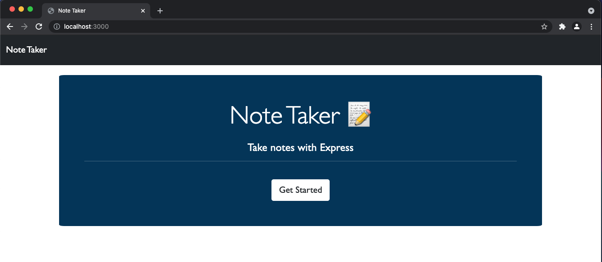
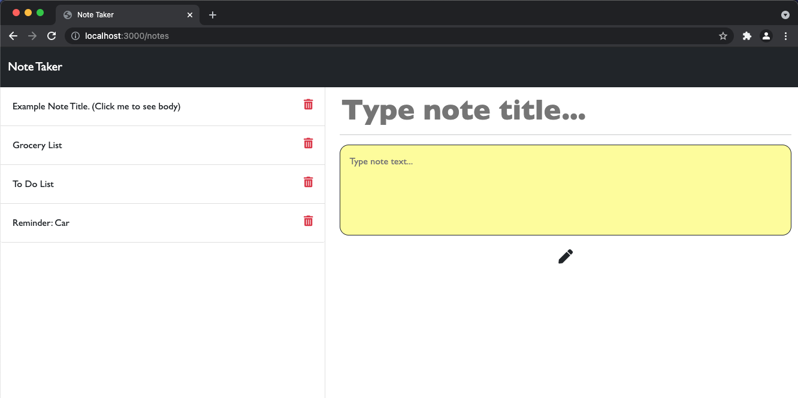
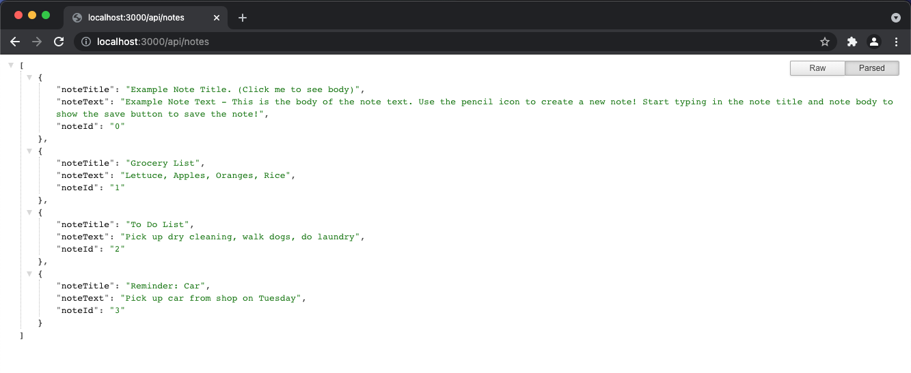

# Note Taker
Note taker app using Express.js

 
 
 
 
 
 

### Deployed Heroku App: 

### Github: https://github.com/ssharp0/note-taker 

## Table of Contents

- [Description](#description)
- [User Story](#user-story)
- [Usage](#usage)
- [Installation](#installation)
- [Screenshots](#screenshots)

## Description
An application to write, save and delete notes using Express.js back end to write/retrieve from db (database).

## User Story

The user will be able to write and save notes - by adding a note's title and text description.

If the user refereshes the page, then the saved notes will continue persist on the page.

The user will also be able to delete notes that have been written/saved previously. 

A user will be able to keep track of information they have written.

## Usage

The user will be able to get started from the main page which will take the user to the notes page. 

On the notes page, the user can write and save new notes. The user can write new notes by clicking the pencil icon and can save notes using the save icon.

The user can also click on an existing saved note in the saved notes column and will see the title and text description populate in the note section. 

The user can also delete an existing saved note by clicking the delete icon in the saved note item.

## Installation

`npm init -y`

`npm i express`

`npm install --save-dev nodemon`

## Screenshots
(showing localhost:3000/notes using nodemon)

Home Page:

Notes Page Demo:

Notes API Data Object Example:
